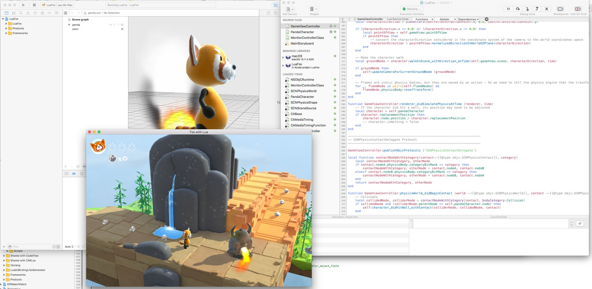

# LuaPanda

LuaPanda is a small 3D SceneKit game written mostly in Lua. It is based on a code sample from Apple.

You run the character —a red panda— in a 3D scene, with the arrow keys, and use the mouse to change the camera position. The character can collect pearls and flowers on his way, but it shall avoid to be touched by the enemy's fire.

## Configuration required

A Mac with Celedev CodeFlow version 1.0.3 or later, and Xcode 7 or later.

The LuaPanda application runs on a Mac with macOS 10,11 El Capitan or later.

## How to use this code sample

1. Open the CodeFlow project for this sample application.  
  This will automatically update the associated Xcode project, so that paths and other build settings are correctly set for your environment.

2. Open the associated Xcode project. You can do this in CodeFlow with the menu command `Program -> Open Xcode Project`.

3. Run the application.

4. Play with the Lua code, with 3D models, textures, particle generators… and benefit from the dynamic updates in the running app.

## Troubleshooting

- **Some libraries / header files in the sample app Xcode project are missing**

  **⇒ Fix**: simply open the corresponding CodeFlow project, and CodeFlow will update the associated Xcode project, so that paths and libraries are correctly set.

## License

This application is provided under the MIT License (MIT)

Copyright (c) 2014-2016 Celedev.

Permission is hereby granted, free of charge, to any person obtaining a copy
of this software and associated documentation files (the "Software"), to deal
in the Software without restriction, including without limitation the rights
to use, copy, modify, merge, publish, distribute, sublicense, and/or sell
copies of the Software, and to permit persons to whom the Software is
furnished to do so, subject to the following conditions:

The above copyright notice and this permission notice shall be included in
all copies or substantial portions of the Software.

THE SOFTWARE IS PROVIDED "AS IS", WITHOUT WARRANTY OF ANY KIND, EXPRESS OR
IMPLIED, INCLUDING BUT NOT LIMITED TO THE WARRANTIES OF MERCHANTABILITY,
FITNESS FOR A PARTICULAR PURPOSE AND NONINFRINGEMENT. IN NO EVENT SHALL THE
AUTHORS OR COPYRIGHT HOLDERS BE LIABLE FOR ANY CLAIM, DAMAGES OR OTHER
LIABILITY, WHETHER IN AN ACTION OF CONTRACT, TORT OR OTHERWISE, ARISING FROM,
OUT OF OR IN CONNECTION WITH THE SOFTWARE OR THE USE OR OTHER DEALINGS IN
THE SOFTWARE.

---

Part of this software is copyright (C) 2014 Apple Inc, specifically the Objective-C source files with Apple-copyrighted headers and the graphic files part of the `SceneKitVehicle` Xcode project.

These files are provided under the following license:

> IMPORTANT:  This Apple software is supplied to you by Apple
Inc. ("Apple") in consideration of your agreement to the following
terms, and your use, installation, modification or redistribution of
this Apple software constitutes acceptance of these terms.  If you do
not agree with these terms, please do not use, install, modify or
redistribute this Apple software.

> In consideration of your agreement to abide by the following terms, and
subject to these terms, Apple grants you a personal, non-exclusive
license, under Apple's copyrights in this original Apple software (the
"Apple Software"), to use, reproduce, modify and redistribute the Apple
Software, with or without modifications, in source and/or binary forms;
provided that if you redistribute the Apple Software in its entirety and
without modifications, you must retain this notice and the following
text and disclaimers in all such redistributions of the Apple Software.
Neither the name, trademarks, service marks or logos of Apple Inc. may
be used to endorse or promote products derived from the Apple Software
without specific prior written permission from Apple.  Except as
expressly stated in this notice, no other rights or licenses, express or
implied, are granted by Apple herein, including but not limited to any
patent rights that may be infringed by your derivative works or by other
works in which the Apple Software may be incorporated.

> The Apple Software is provided by Apple on an "AS IS" basis.  APPLE
MAKES NO WARRANTIES, EXPRESS OR IMPLIED, INCLUDING WITHOUT LIMITATION
THE IMPLIED WARRANTIES OF NON-INFRINGEMENT, MERCHANTABILITY AND FITNESS
FOR A PARTICULAR PURPOSE, REGARDING THE APPLE SOFTWARE OR ITS USE AND
OPERATION ALONE OR IN COMBINATION WITH YOUR PRODUCTS.

> IN NO EVENT SHALL APPLE BE LIABLE FOR ANY SPECIAL, INDIRECT, INCIDENTAL
OR CONSEQUENTIAL DAMAGES (INCLUDING, BUT NOT LIMITED TO, PROCUREMENT OF
SUBSTITUTE GOODS OR SERVICES; LOSS OF USE, DATA, OR PROFITS; OR BUSINESS
INTERRUPTION) ARISING IN ANY WAY OUT OF THE USE, REPRODUCTION,
MODIFICATION AND/OR DISTRIBUTION OF THE APPLE SOFTWARE, HOWEVER CAUSED
AND WHETHER UNDER THEORY OF CONTRACT, TORT (INCLUDING NEGLIGENCE),
STRICT LIABILITY OR OTHERWISE, EVEN IF APPLE HAS BEEN ADVISED OF THE
POSSIBILITY OF SUCH DAMAGE.

> Copyright (C) 2014 Apple Inc. All Rights Reserved.
