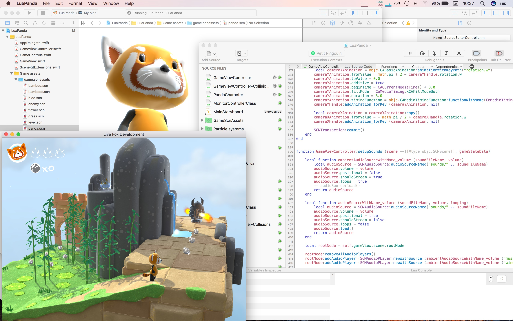

# LuaPanda

LuaPanda is a small 3D SceneKit game written mostly in Lua. It is based on a code sample from Apple.

You run the character —a red panda— in a 3D scene, with the arrow keys, and use the mouse to change the camera position. The character can collect pearls and flowers on his way, but it shall avoid to be touched by the enemy's fire.

But the really interesting part is what is inside the box.

This code sample shows how to mix dynamic code update and dynamic SceneKit assets in an application, so you can change basically anything in the game while it is running, without leaving the current game state. 

For example, if you change a 3D model in the `game.scnassets` directory, the SceneKit scenes are automatically recompiled and reloaded into the application. Then the Lua code in the app just has to update the SCNScene objects and re-apply the current game state information to the scene. 

All this update process only takes a few seconds to run, therefore it is way much faster and more interactive than the traditional change-compile-run process for game development. And changes in (dynamic) Lua code are applied even faster (typically in less than one second).

## Configuration required

A Mac with Celedev CodeFlow version 1.0.3 or later, and Xcode 7 or later.

The LuaPanda application runs on a Mac with macOS 10,11 El Capitan or later.

## How to use this code sample

1. Open the CodeFlow project for this sample application.  
  This will automatically update the associated Xcode project, so that paths and other build settings are correctly set for your environment.

2. Open the associated Xcode project. You can do this in CodeFlow with the menu command `Program -> Open Xcode Project`.

3. Run the application.

4. Play with the Lua code, with 3D models, textures, particle generators… and benefit from the dynamic updates in the running app.

## Troubleshooting

- **Some libraries / header files in the sample app Xcode project are missing**

  **⇒ Fix**: simply open the corresponding CodeFlow project, and CodeFlow will update the associated Xcode project, so that paths and libraries are correctly set.

## License

This application is provided under the MIT License (MIT).

Copyright (c) 2014-2016 Celedev.

Permission is hereby granted, free of charge, to any person obtaining a copy
of this software and associated documentation files (the "Software"), to deal
in the Software without restriction, including without limitation the rights
to use, copy, modify, merge, publish, distribute, sublicense, and/or sell
copies of the Software, and to permit persons to whom the Software is
furnished to do so, subject to the following conditions:

The above copyright notice and this permission notice shall be included in
all copies or substantial portions of the Software.

THE SOFTWARE IS PROVIDED "AS IS", WITHOUT WARRANTY OF ANY KIND, EXPRESS OR
IMPLIED, INCLUDING BUT NOT LIMITED TO THE WARRANTIES OF MERCHANTABILITY,
FITNESS FOR A PARTICULAR PURPOSE AND NONINFRINGEMENT. IN NO EVENT SHALL THE
AUTHORS OR COPYRIGHT HOLDERS BE LIABLE FOR ANY CLAIM, DAMAGES OR OTHER
LIABILITY, WHETHER IN AN ACTION OF CONTRACT, TORT OR OTHERWISE, ARISING FROM,
OUT OF OR IN CONNECTION WITH THE SOFTWARE OR THE USE OR OTHER DEALINGS IN
THE SOFTWARE.
